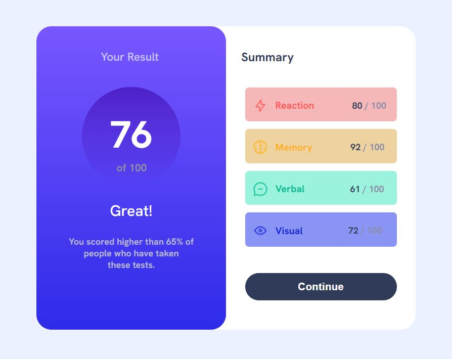
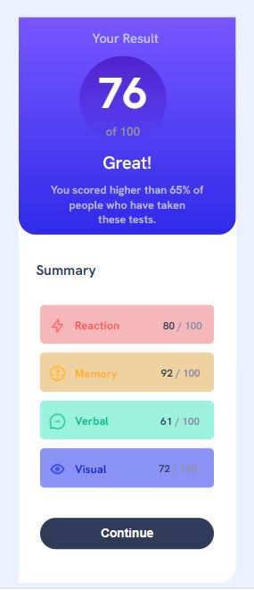

# Result Summary Component

This project is a web page implementation of the "Result Summary Component" challenge from [Frontend Mentor](https://www.frontendmentor.io/challenges/results-summary-component-CE_K6s0maV). 

#### Desktop Design


#### Mobile Design


You can access the live demo of this project here: [Result Summary Card Demo](https://mehwishjbe.github.io/result-summary-card/)

## Table of Contents

- [Technologies Used](#technologies-used)
- [Project Structure](#project-structure)
- [Getting Started](#getting-started)

## Technologies Used

- HTML
- CSS
- [GitHub Pages](https://pages.github.com/) for hosting the project

## Project Structure

The project structure is simple and includes the following files and directories:

- `index.html`: The main HTML file for the result summary page.
- `style.css`: The CSS stylesheet for styling the page.
- `images/`: A directory containing image assets used in the project.

## Getting Started

To get a local copy of this project up and running on your machine, you can follow these steps:

1. Clone this repository:

   ```bash
   git clone https://github.com/mehwishjbe/result-summary-card.git
